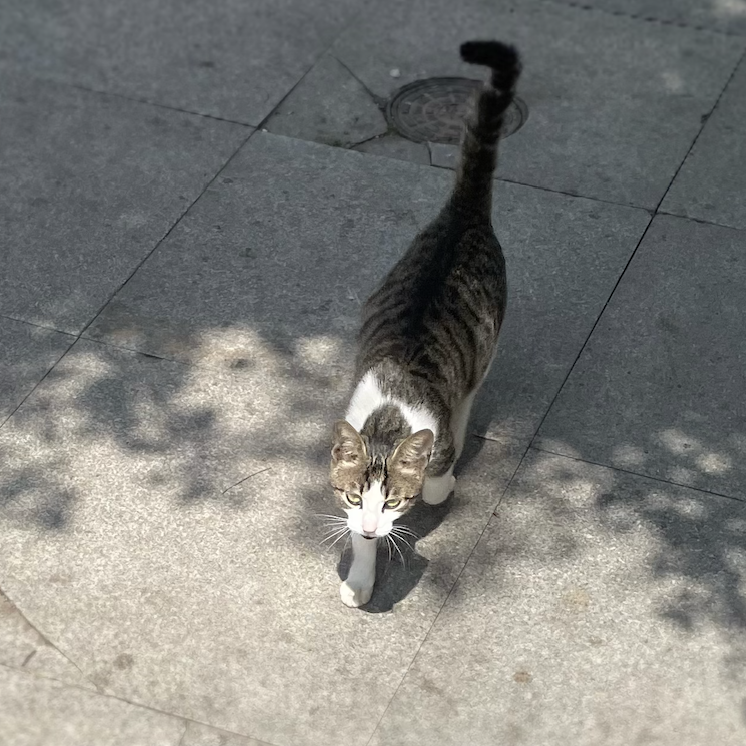

# Choco.cpp

> 当你想吃巧克力🍫的时候，你会想起我

牛奶巧克力的名字来源于



## 代码风格

Choco.cpp 的项目设定是 **【面向数据设计 DOD】**

所以整体代码风格会偏 C#：

```cpp
struct A {
    // 公开成员 大写开头驼峰
    int PublicMember;
    
    // 私有成员 小写开头驼峰
    int privateMember;
    
    // 公开方法 大写开头驼峰
    void PublicCall();
    
    // 私有方法 小写开头驼峰
    void internalCall();
};
```

> 总之，公开就大写，不公开就小写开头

另外呢，你要是实在想把 私有成员 保护起来不让别人访问，那就 干脆标记到 private 区域吧：

```cpp
struct A {
    int PublicMember;
    
private:
    int privateMember;
};
```

## 许可证

BSD 2-Clause License

